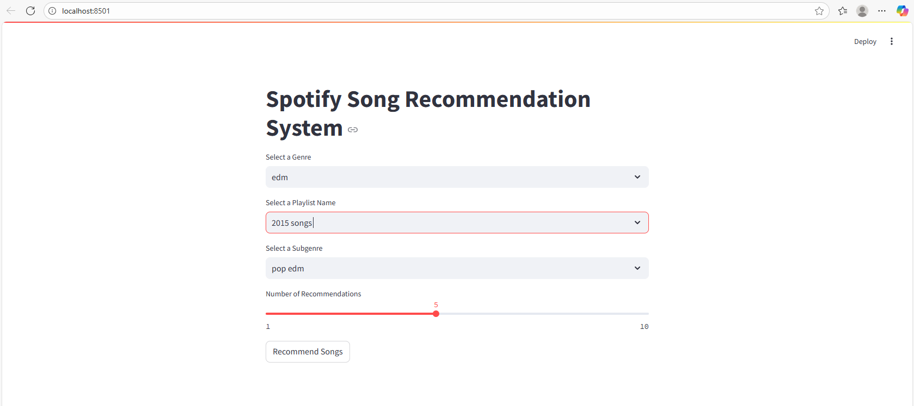
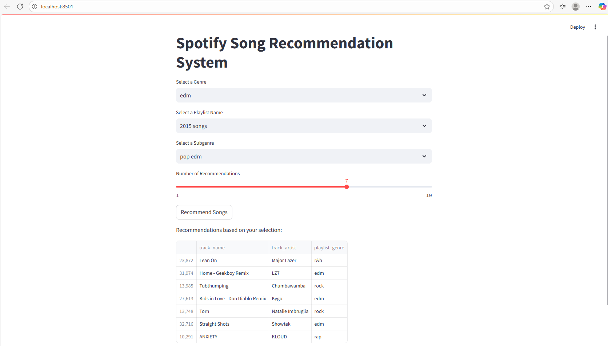
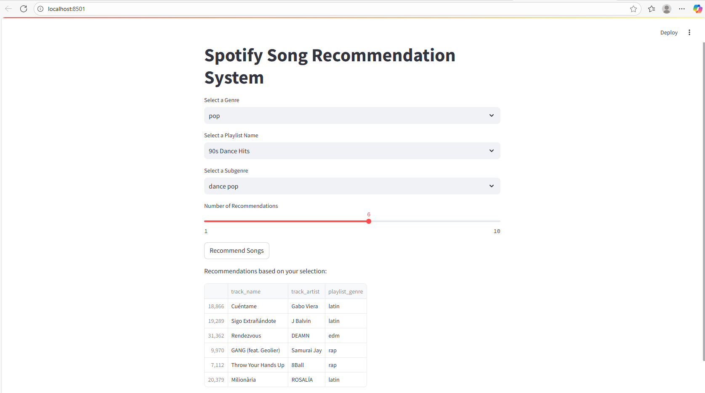

# Spotify Music Recommendation System

## Project Description

This project is a music recommendation system built using a Spotify dataset. It uses machine learning to group similar songs into clusters and recommends music based on these clusters. The project includes a data analysis notebook, a Python script with the core logic, and a Streamlit web application to provide a user-friendly interface for getting song recommendations.

## Features

- **Data Pre-processing:** Cleans the dataset by handling missing values and duplicates.
- **Exploratory Data Analysis:** Analyzes the relationships between different audio features using a correlation matrix.
- **Clustering:** Uses the K-Means algorithm to group songs based on their audio features.
- **Elbow Method:** Determines the optimal number of clusters for the K-Means algorithm.
- **Interactive Web App:** A Streamlit application that allows users to get song recommendations based on their choice of genre, playlist, and subgenre.

## Screenshots

<div style="text-align: center;">
  Main Interface:
  
</div>

<div style="text-align: center;">
  Recommendations:
  
  <br>
  <br>
  
</div>

## Project Steps

1.  **Data Loading and Cleaning:**
    *   Load the `spotify_dataset.csv` into a pandas DataFrame.
    *   Handle missing values by dropping rows with `dropna()`.
    *   Remove duplicate entries using `drop_duplicates()`.

2.  **Exploratory Data Analysis (EDA):**
    *   Select numerical features from the dataset.
    *   Calculate the correlation matrix of these features.
    *   Visualize the correlation matrix using a heatmap with `seaborn` and `matplotlib`.

3.  **Clustering Model:**
    *   Scale the numerical features using `StandardScaler`.
    *   Use the Elbow Method to find the optimal number of clusters (k). This involves iterating through a range of k values and plotting the inertia.
    *   Apply the K-Means algorithm with the optimal k (k=4) to cluster the songs.
    *   Add the cluster labels back to the main DataFrame.

4.  **Visualization of Clusters:**
    *   Use Principal Component Analysis (PCA) to reduce the dimensionality of the features to 2 components for visualization.
    *   Create a scatter plot to visualize the song clusters.

5.  **Building the Recommendation System:**
    *   Develop a function that takes a song as input and finds its cluster.
    *   The function then returns a random sample of other songs from the same cluster.

6.  **Creating the Web Application:**
    *   Build an interactive web application using Streamlit.
    *   Create dropdowns for users to select genre, playlist, and subgenre.
    *   Implement a "Recommend" button that triggers the recommendation logic based on the user's selection and displays the recommended songs.

## Files in the Project

- **`app.py`:** The main file for the Streamlit web application. This is the file you will run to use the recommendation system.
- **`spotify_dataset.csv`:** The dataset used for the project.
- **`SpotifySongGenre.ipynb`:** A Jupyter Notebook containing the detailed step-by-step analysis, including data pre-processing, visualization, and model building.
- **`recommender.py`:** A Python script that contains the core logic for the recommendation system, including data cleaning, clustering, and the recommendation function.

## How to Use

1.  **Install the required libraries:**
    ```
    pip install streamlit pandas scikit-learn
    ```
2.  **Run the Streamlit app:** Open a terminal or command prompt, navigate to the project directory, and run the following command:
    ```
    streamlit run app.py
    ```
3.  This will open the application in your web browser. You can then select a genre, playlist, and subgenre to get song recommendations.

## Technologies Used

- Python
- pandas
- scikit-learn
- Streamlit
- Matplotlib
- Seaborn
